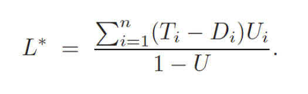
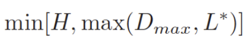
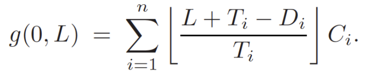

# EDF Schedulability Analyzer

This Python code allows you to check if a list of periodic tasks is schedulable using the EDF algorithm.
Schedulability analysis is performed using the "Reducing Task Intervals" method.

## Installing

1. **Prerequisites**:
   - Ensure that Python is installed on your system.

## Usage

1. **Specify Tasks**:
   - Specify your periodic tasks in the `input.json` file with the sample format.

2. **Run the Application**:
   - Execute `main.py` to run the application:
     ```sh
     python main.py
     ```
   - Here is an example output of this program:
     ```
      L       |g(0, L)        |Result
      8       |1              |OK
      12      |7              |OK
      15      |15             |OK
      18      |16             |OK
      27      |22             |OK
      28      |23             |OK
     ```

## How It Works

Initially, the program calculates L<sup>*</sup> using this formula:



Then, it uses this formula to determine the maximum time to check schedulability:



Next, it calculates a list of all absolute deadlines for all tasks that are less than the maximum time calculated in the previous step.

Finally, it checks schedulability for each time by calculating the demand-bound function using the following formula and comparing it to the time:


